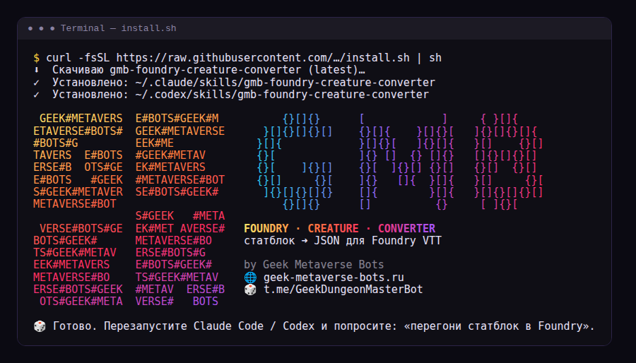
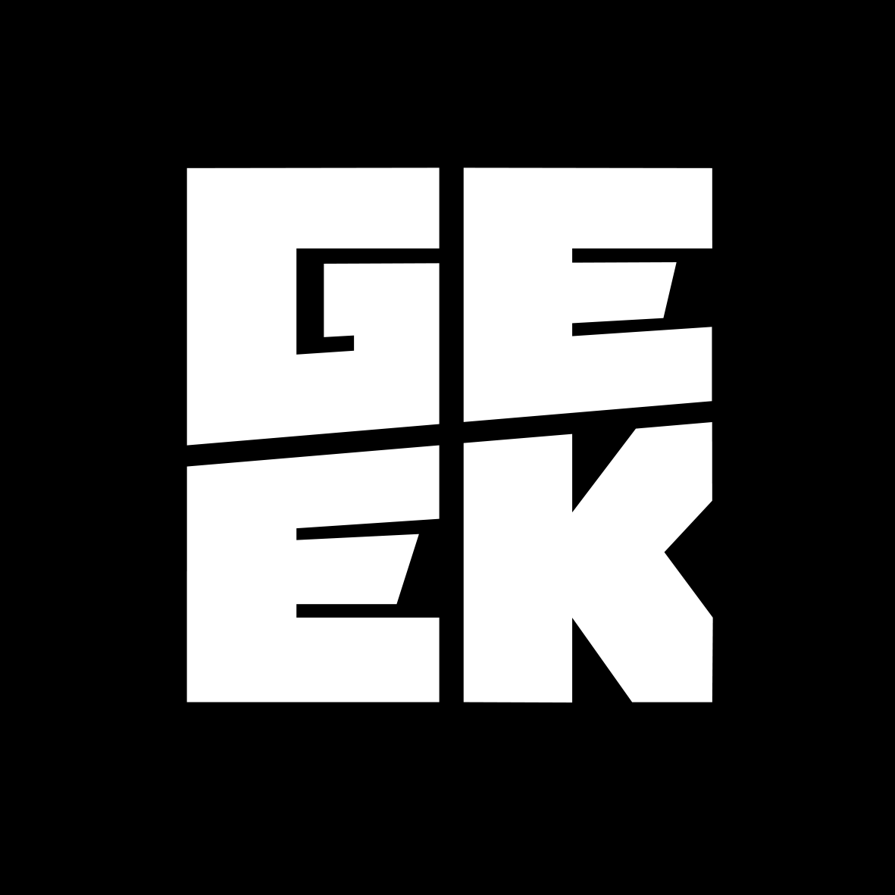

<div align="center">



# GMB Foundry Creature Converter

**Статблок → JSON для Foundry VTT за один запрос.**
Скилл для Claude, Codex и любых LLM: вставьте текст монстра, умения или скриншот страницы,
получите файл, который Foundry импортирует с работающими бросками.

[](https://foundryvtt.com)
[](https://github.com/foundryvtt/dnd5e)
[](#-установка)
[](#-установка)
[](https://geek-metaverse-bots.ru/)
[](https://t.me/GeekDungeonMasterBot)

</div>

---

## ✦ Что это

Перенос монстров в Foundry руками — это полчаса кликов на каждое существо: заполнить
характеристики, создать атаки, настроить «активности», не забыть перезарядку дыхания и
стоимость легендарных действий. GMB Foundry Creature Converter делает это за вас.

Вы даёте модели **что угодно**:

- статблок из книги, с dnd.su, из PDF или Discord — на русском или английском, правила 2014 или 2024;
- скриншот или фото страницы со статблоком;
- отдельное умение, атаку, заклинание или предмет;
- просьбу придумать существо («босс-некромант для группы 5 уровня»).

На выходе — `fvtt-Actor-<имя>.json`, который импортируется через **Import Data**
и сразу работает: атаки бросаются с правильным бонусом, спасброски показывают СЛ,
урон считается по типам, перезарядки и легендарные действия тратятся сами.

## ✦ Что умеет

| | |
|---|---|
| ⚔️ **Атаки** | Бонус к попаданию и урон точно как в статблоке: скилл сам вычисляет характеристику и бонус мастерства, вычитает модификатор из урона оружия (Foundry прибавит его обратно) |
| 🛡️ **Защиты** | Спасброски, навыки (включая экспертизу), сопротивления «от немагических атак», иммунитеты к состояниям |
| 🐉 **Легендарность** | Легендарные действия со стоимостью, легендарное сопротивление с расходом, действия логова |
| 🔥 **Перезарядки** | «Перезарядка 5–6», «3/день», «после отдыха» |
| ✨ **Заклинания** | Врождённые и неограниченные заклинания, ячейки, СЛ от заклинательной характеристики |
| 💀 **Состояния** | Отравление, опутывание и прочее накладываются эффектом при провале спасброска |
| 🖼️ **Картинки** | Читает статблок со скриншота; арт превращает в портрет и токен |
| ✅ **Проверка** | Валидатор ловит ошибки, которые ломают импорт, и печатает статблок для сверки с оригиналом |

## ✦ Как это работает

```text
  ┌──────────────┐     ┌──────────────┐     ┌────────────────┐     ┌──────────────┐
  │  статблок    │     │    spec      │     │  Foundry JSON  │     │   Foundry    │
  │  скриншот    │ ──▶ │  ~30 строк   │ ──▶ │  ~20–100 КБ    │ ──▶ │  Import Data │
  │  умение      │ LLM │  то, что     │ py  │  ID, activities│     │  🎲 броски   │
  │  идея        │     │  в тексте    │     │  proficiency   │     │  работают    │
  └──────────────┘     └──────────────┘     └────────────────┘     └──────────────┘
                                                    │
                                                    ▼
                                          validate_foundry.py
                                     ✓ структура  ✓ сверка чисел
```

Модель делает то, что умеет лучше всего — **понимает текст**. Скрипт делает то, в чём
модели ошибаются — **сантехнику** Foundry: 16-символьные ID, которые должны совпадать,
вложенные активности, математику бонуса мастерства. Если Python недоступен, модель
пишет JSON по подробному справочнику и готовым образцам.

## ✦ Установка

Выберите, где вы работаете. Везде — одна команда или одна кнопка.

### ⚡ Любой агент одной командой (Claude Code, Codex, Cursor, Gemini CLI…)

```bash
npx skills add GITHUB_USER/GMB-Foundry-Creature-Converter
```
Нужен только Node.js. Установщик сам найдёт агентов на компьютере и положит скилл куда нужно.

<details>
<summary>🎨 Как выглядит установка в терминале</summary>
<br>


Баннер показывается при установке и один раз при первом ручном запуске скриптов в терминале.
Вызвать его снова: `python scripts/build_foundry.py --banner`. Отключить цвета: `NO_COLOR=1`.
Внутри агентов (Claude, Codex) баннер не печатается, чтобы не засорять их вывод.
</details>

###  Claude Code — как плагин

Внутри Claude Code:
```text
/plugin marketplace add GITHUB_USER/GMB-Foundry-Creature-Converter
/plugin install gmb-foundry-creature-converter@geek-metaverse-bots
```
Обновление: `/plugin marketplace update geek-metaverse-bots`.

### 🐧 macOS / Linux — скрипт

```bash
curl -fsSL https://raw.githubusercontent.com/GITHUB_USER/GMB-Foundry-Creature-Converter/main/install.sh | sh
```
Ставит в Claude Code и в Codex сразу. Только в один: `... | TARGET=claude sh` или `TARGET=codex`.
Повторный запуск обновляет до последней версии.

### 🪟 Windows — PowerShell

```powershell
irm https://raw.githubusercontent.com/GITHUB_USER/GMB-Foundry-Creature-Converter/main/install.ps1 | iex
```

###  Claude в браузере и Claude Desktop

Тут команд нет, но всё равно в два клика:

1. **[⬇ Скачать последнюю версию](https://github.com/GITHUB_USER/GMB-Foundry-Creature-Converter/releases/latest/download/gmb-foundry-creature-converter.zip)** (ссылка всегда ведёт на свежий релиз).
2. В Claude откройте раздел **Skills** (Customize → Skills или Settings → Capabilities → Skills) → **Upload skill** → выберите файл.

Нужен платный тариф и включённое выполнение кода.

### 🌐 ChatGPT, Gemini, DeepSeek и другие чаты

Установка не нужна: скопируйте [`PROMPT.md`](PROMPT.md) в начало диалога и приложите файлы
`references/foundry-schema.md` и `examples/fvtt-Actor-myconid-tyrant.json` из папки скилла.

### 🛠 Без нейросети

```bash
python skills/gmb-foundry-creature-converter/scripts/build_foundry.py my-monster.spec.json
python skills/gmb-foundry-creature-converter/scripts/validate_foundry.py fvtt-Actor-my-monster.json
```
Python 3.8+, никаких зависимостей.

## ✦ Как пользоваться

Просто попросите:

> Перегони в Foundry: *(вставить статблок)*

> Вот скрин монстра из книги, сделай JSON для фаундри

> Сделай отдельным предметом умение «Морозное дыхание»: конус 15 фт., спасбросок Телосложения Сл 13, 2к8 холодом, 2 раза за долгий отдых

> Придумай гоблина-шамана ПО 3 и сразу дай JSON. У меня Foundry 13

### Импорт в Foundry

1. Вкладка **Actors** → создайте NPC с любым именем.
2. Правый клик по нему → **Import Data** → выберите файл.
3. Готово: имя, характеристики, атаки и картинка подтянутся из файла.

Умения и предметы — так же, через вкладку **Items**. Потом их можно перетащить на любого персонажа.

> [!TIP]
> Если прикладывали арт существа, загрузите картинку в Foundry по пути, указанному в ответе
> (по умолчанию `tokens/<имя>.webp`), или выберите её кликом по портрету после импорта.

### Версии Foundry

| Foundry | dnd5e | флаг |
|---|---|---|
| v14 | 6.x | по умолчанию |
| v13 | 5.x | `--format v5` (или скажите модели «у меня Foundry 13») |

## ✦ Структура

```text
GMB-Foundry-Creature-Converter/
├── skills/
│   └── gmb-foundry-creature-converter/ ← сам скилл
│       ├── SKILL.md                 ← инструкция для модели
│       ├── scripts/
│       │   ├── build_foundry.py     ← spec → Foundry JSON
│       │   ├── validate_foundry.py  ← проверка + сводка статблока
│       │   └── banner.py            ← цветной ASCII-баннер для терминала
│       ├── references/
│       │   ├── spec-format.md       ← все поля spec и паттерны
│       │   ├── dictionary-ru.md     ← русские термины → ключи системы
│       │   └── foundry-schema.md    ← формат Foundry для ручной сборки
│       └── examples/                ← текст → spec → готовый JSON
├── .claude-plugin/                  ← маркетплейс и плагин для Claude Code
├── .github/workflows/               ← автотесты и сборка релизов
├── install.sh / install.ps1         ← установка одной командой
├── AGENTS.md                        ← подсказка для Codex и других агентов
├── PROMPT.md                        ← универсальный промпт для любой LLM
└── assets/                          ← баннеры, логотип, генератор (src/make_banner.py)
```

## ✦ Ограничения

- Только система **dnd5e**. Pathfinder и другие системы не поддерживаются.
- Персонажи игроков с классами и прокачкой не собираются целиком, но их умения можно
  перенести отдельными предметами.
- Заклинания монстров создаются прямо в листе. Если хотите версии из компендиума с
  полной автоматизацией, перетащите их поверх.
- Модель может ошибиться при чтении размытого скриншота. Сверяйте сводку, которую
  печатает валидатор, с оригиналом.

## ✦ Для мейнтейнеров: выпуск версии

```bash
git tag v1.0.1 && git push origin v1.0.1
```
GitHub Actions прогонит тесты, соберёт `gmb-foundry-creature-converter.zip` / `.skill` и
приложит их к релизу. Ссылки «latest» и все установщики сразу начнут отдавать новую версию.
Не забудьте поднять `version` в `.claude-plugin/*.json`.

## ✦ Участие

Нашли статблок, который сломал конвертер? Откройте issue и приложите текст.
Pull request с новым примером в `examples/` — лучший способ сделать скилл умнее.

---

<div align="center">

<a href="https://geek-metaverse-bots.ru/"></a>

### Сделано командой Geek Metaverse Bots

Мы делаем полезности для игроков и мастеров: Telegram-боты по D&D, Warhammer 40,000,
Warcraft и мифам Лавкрафта — правила, лор, поиск и генерация материалов.

**[🌐 geek-metaverse-bots.ru](https://geek-metaverse-bots.ru/)** · **[🎲 бот для D&D — @GeekDungeonMasterBot](https://t.me/GeekDungeonMasterBot)**

<sub>Лицензия MIT · D&D и Dungeons & Dragons — товарные знаки Wizards of the Coast. Foundry Virtual Tabletop — товарный знак Foundry Gaming LLC. Проект не связан с ними официально.</sub>

</div>
